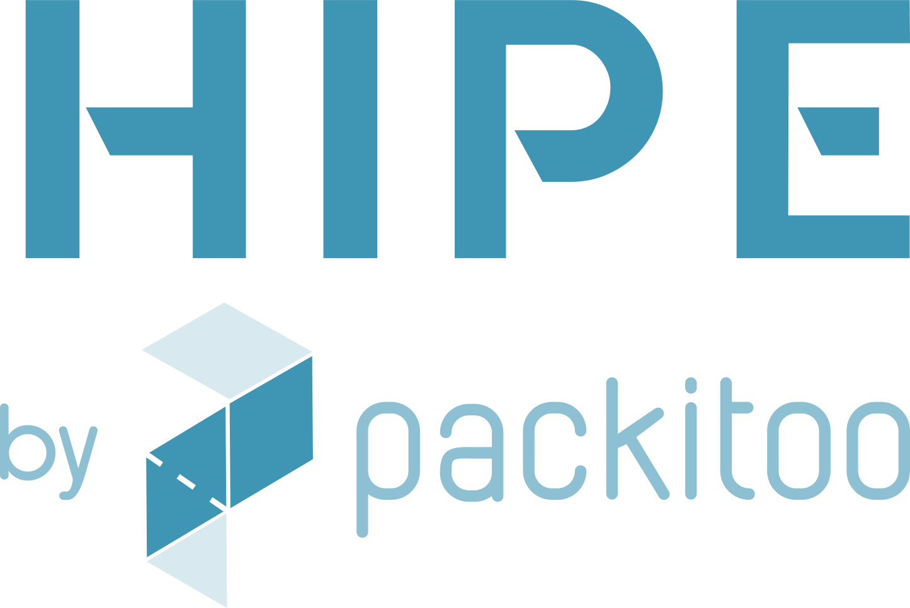

# n8n-nodes-hipe

<!-- TODO: Add npm version badge, CI status, Packitoo logo, and other relevant badges here -->




Official n8n integration node for [HIPE](https://hipe.packitoo.com) by Packitoo.

Easily connect your n8n workflows to the HIPE SaaS API to automate business processes, manage users, companies, projects, and more.

---

## Table of Contents
- [Module Readiness](#module-readiness)
- [Installation](#installation)
- [Getting Started](#getting-started)
- [Usage](#usage)
- [Authentication](#authentication)
- [Contributing](#contributing)
- [Support](#support)
- [License](#license)

---


## Module Readiness

| Module       | Status   | Notes                                      |
| ------------ | -------- | ------------------------------------------ |
| Users        | ✅ Ready | Full CRUD                                  |
| Companies    | ✅ Ready | Full CRUD                                  |
| Projects     | ✅ Ready | Full CRUD                                  |
| Pipelines    | ✅ Ready |                                            |
| Statuses     | ✅ Ready |                                            |
| Addresses    | ✅ Ready |                                            |
| Corrugated   | 🟡 Partial | Some submodules in progress                |
| Articles     | 🚧 Planned |                                            |
| Orders       | 🚧 Planned |                                            |
| Quotes       | 🚧 Planned |                                            |

<!-- Update this table as modules mature -->

## Installation

### From npm (recommended)
```bash
npm install n8n-nodes-hipe
```

### From GitHub (latest/dev)
```bash
npm install github:packitoo/n8n-nodes-hipe
```

## Getting Started
1. Install the node as above.
2. Restart n8n if running locally.
3. Add the "HIPE" node to your workflow from the n8n node palette.
4. Configure authentication (see below).

## Authentication

To use this node, you need an API token from HIPE.

- Follow the guide here: [Create Access Token](https://developers.packitoo.com/guides/create-access-token/)
- Enter your token in the HIPE credentials section when configuring the node in n8n.

## Usage

Basic usage involves adding the HIPE node to your workflow and selecting the desired module and operation. For detailed usage and examples, see the [examples directory](./examples) or the inline documentation in n8n.

> **Tip:** Hover over each parameter in the node UI for helpful descriptions.

### Pagination & Sorting

Companies and Projects List actions use flat pagination and sorting:

- Query params: `page`, `limit`, flat filters (e.g. `status`, `search`)
- Sorting: single `sort` parameter as "field,ASC|DESC"

See the full guide: [docs/pagination.md](./docs/pagination.md)

## Contributing

Contributions are welcome! Please see [CONTRIBUTING.md](./CONTRIBUTING.md) for guidelines.

- Open issues for bugs or feature requests
- Submit pull requests for improvements

## Support

- For common issues and questions, please use [GitHub Issues](https://github.com/packitoo/n8n-nodes-hipe/issues).
- For integration help or custom pipeline requests, please contact your assigned Customer Success Manager.

## License

MIT © [Packitoo](https://packitoo.com)

---

<!-- TODO: Add links to documentation, and other resources as needed -->
